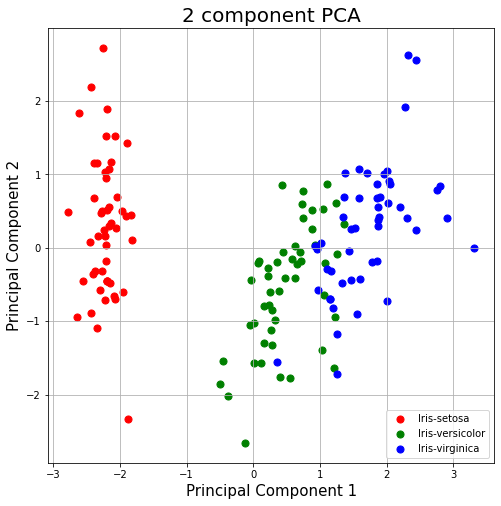

## Dimensionality Reduction and Visualization of Iris Dataset Using Principal Component Analysis (PCA) :
Principal Component Analysis is an unsupervised learning algorithm that is used for the dimensionality reduction in machine learning.

Here, we have
* Applied PCA to reduce the dimensionality of the Iris dataset from 4 to 2 components.
* Visualized species clusters using matplotlib, showing a clear separation of Iris-setosa and partial overlap of Iris-versicolor and Iris-virginica.
* Achieved 95.8% data variance capture using two principal components.
* Utilized Python libraries such as pandas, scikit-learn, and matplotlib for data preprocessing, standardization, and visualization.

**Output:**
`array([0.72770452, 0.23030523])` :
means that Principal Component 1 explains 72.77% of the variance and Principal Component 2 explains 23.03%, capturing a total of 95.8% of the data's variance.

**Interpretation of the Visualization:**
* The scatter plot shows the separation of the Iris species (*Setosa*, *Versicolor*, and *Virginica*) based on two principal components.
* Iris-setosa (Red) forms a distinct, separate cluster, meaning it can be easily distinguished from the other two species.
* Iris-versicolor (Green) and Iris-virginica (Blue) overlap more, indicating they are more similar to each other and may not be as easily separable using only these two principal components.

**Conclusion:** 
Principal Component 1 accounts for the majority of the variance and helps distinguish *Iris-setosa* from the other species. However, additional components might be needed to better distinguish between *Versicolor* and *Virginica*.